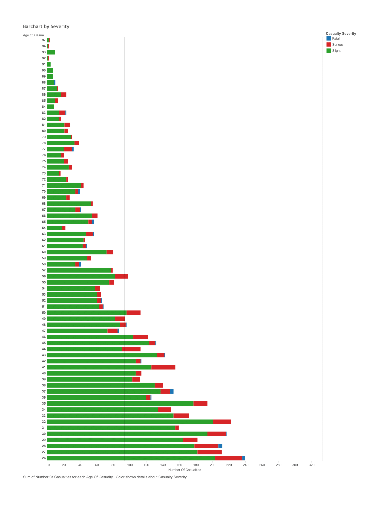
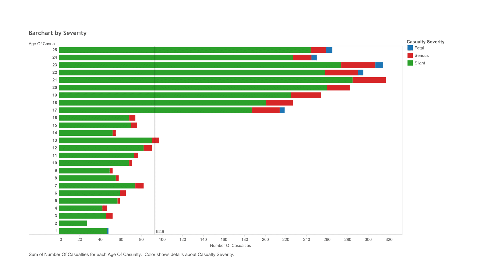
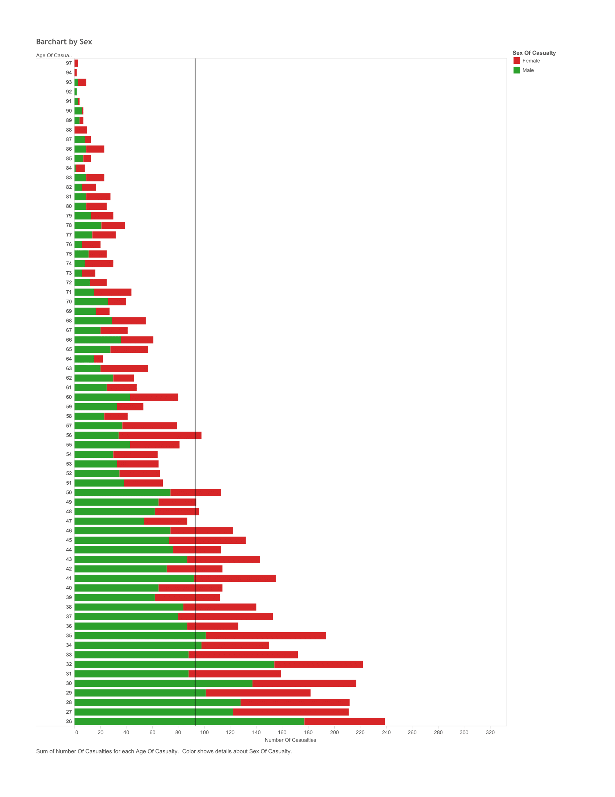
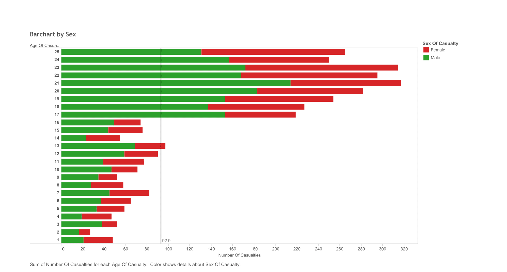

##Road Accidents in Leeds, England  

``` {r}
source("../01 Data/dataframe.R", echo = FALSE)
summary(accidents)
```


<h3>Tableau Plots:</h3>  
<h4>Boxplot:</h4>  

<br>  
To create this boxplot begin by unchecking Aggregate Measures under the Analysis tab, then click on Number of Casualties under measures, and then click on the Boxplot icon under the Show Me tab. Drag Type of Vehicle onto columns, and Number of Vehicles onto color.
<br>  
This boxplot displays the type of vehicle involved in a vehicle collision vs. the number of casualties caused by the collision. The variance of color for each data point represents the number of vehicles involved in the accident with green representing the lowest value of 1 and red the highest value of 8. Notice the column labeled car: this display shows that car accidents account for the highest number of accidents in Leeds, as well as involve the highest amount of vehicles per accident.
<br>  
<h4>Histogram:</h4>  
 
To create this histogram first make sure that Aggregate measures is checked under the Analysis tab, then click Age of Casualty under measures, and then click on the Histogram icon under the Show Me tab. Change the bin size to 1 by clicking on Age of Casualty (bin) in the Dimensions box and clicking edit to show every age. Drag Lighting Conditions onto color and filters.
<br>  
The histogram is partioned by age every one year to show the lighting conditions of the environment during each accident and how many people of each age were involved. From the data, we can see that at around 17 years of age, the number of casualties increase until age 23, when it becomes the highest. From there, the trend of number of casualties begins to decrease. Furthermore, the histogram shows that most accidents in Leeds occur during daylight and in the presence of streetlights. 
<h4>Scatterplot and its corresponding map:</h4>  
 
<br>
 
<br>  
To create this scatterplot begin by unchecking Aggregate Measures under the Analysis Tab, then drag Grid Ref Easting onto columns and Grid Ref Northing onto rows. Drag Number of Casualties onto color and filters, and then click quick fliter. Right click on each axis, then select edit axis. From there click Fixed Range and choose 422,000 the Start and 451,000 as the End for the Y-axis. Now follow the same steps for the X-axis but choose the starting value to be 413,000 and the End value to be 447,000.
<br>  
In England, instead of using latitude and longitude, they use a UTM system, Universal Transverse Mercator, to produce conformal projections of locations on Earth. Our data set included the Northing and Easting coordinates of the UTM system. Using this we plotted Easting vs Northing coordinates to produce a scatterplot mapping of accidents where each data point represents an accident. Additionally, we applied a quick filter on the number of casualties to be able to determine a variance of casualties in different locations. We then searched for a website that would plot the UTM coordinates on a map in order to compare our scatterplot of accidents to a geographical map of Leeds. We plotted some of the outliers of the scatterplot to get a general idea of the radius, as well as a couple of points in the center. Notice that point of the scatterplot follow roads on the map of Leeds. 
<h4>Crosstabs:</h4>  
  
To create this first crosstab begin by making sure that Aggregate Measures is checked, then drag Lighting Conditions onto rows and Weather Conditions onto columns. Then drag Number of Casualties onto color and label. Drag Sex of Casualty onto filters, and then onto rows. Then drag Road Surface onto pages.
<br>    
This crosstab shows the weather conditions vs the lighting conditions by sex of the casualty. The color of each value represents the sum of number of casualties, where blue is the lowest number of casualties and red is the highest. As one traverses each page, one can see the data represented for each road surface-Dry, Ice, Snow, and Wet. The data shows that there weren't many casualties when the roads were icy or snowy. Looking at the road surface when dry, most accidents for both males and females occur when the weather was fine without high winds in the daylight. We can also see that many casualties occured when the road surface was wet but still not as many as when the surface was dry. It is also interesting to note that across all surfaces males mostly had a higher number of casualties.
<br>  
   
To create this second crosstab begin by making sure that Aggregate Measures is checked, and then drag Road Class onto columns and Road Surface onto rows. Make a calculated field called KPI - Casualties that looked like this:
```
IF (ATTR([Casualty Severity]) == 'Fatal' AND (SUM([Number Of Casualties])) <= 11)
THEN "Low"
ELSEIF (ATTR([Casualty Severity]) == 'Serious' AND SUM([Number Of Casualties]) <= 156)
THEN "Low"
ELSEIF (ATTR([Casualty Severity]) == 'Slight' AND SUM([Number Of Casualties]) <= 1431)
THEN "Low"
ELSE "High"
END
```
On the Marks card select Shape. Drag this new calculated field onto shapes. Then drag Causalty Severity onto pages. To change the shape of the data points, click on Edit Shapes under the card that displays "High" and "Low".  
<br>   
This crosstab shows road surface vs road class where each page shows a different serverity of casualty. We created a KPI that represents the number of casualties per casualty severity, where the distinction between high and low depends on the severity of the casualty. We determined what high and low corresponds to by taking the median number of casualties per casualty severity, and labeling any value above the median as "high" and values below as "low". By scrolling through each page we can see that most casualties are "slight" followed by "serious", with "fatal" having the lowest number of casualties. The medians for each are: Fatal = 11, Serious = 156, Slight = 1431.  
For each page the number of casualties was below the corresponding median value.
<br>
<h4>Barcharts:</h4>


To create this bar chart first make sure that Aggregate measures is checked under the analysis tab, then drag Number of Casualties from measures onto columns, and Age of Casualty from dimensions onto rows. Then, drag Casualty Severity onto color. To change the order of the age, right click on the title of the y-axis and click on “Sort Descending.” Next, right click on the x-axis and select “Add Reference Line.” A window should pop up, change label from “computation” to “value” and then click “ok.”
<br>  
Note: In order for me to see the distribution of the Number of Casualties across age, I had to convert Age of Casualty to a dimension so that I could sum the Number of Casualties for each age. If I had not done this Tableau would have proceeded to make a scatterplot instead of a bar chart. To do this, make a duplicate of the measure Age of Casualty by right clicking of the variable and selecting duplicate. Then, drag that copy into the dimensions field. Right click on that same variable you just dragged and hover over “Change Data Type.” Next, select string.
<br>  
This barchart displays the age of the casualty vs the sum of the number of casualties by age. The color shows casualty severity, green representing casualties of slight severity, red representing casualties of serious severity, and blue representing casualties that were fatal. The reference line refers to the average number of casualties which is 93. Notice that most of the casualties were classified as slight with only a few classified as serious and even less as fatal. People ages 13, 17-47, 48-50, and 56 had higher than 93 casualties.
<br>  


<br>  
To create this bar chart first make sure that Aggregate measures is checked under the analysis tab, then drag Number of Casualties from measures onto columns, and Age of Casualty from dimensions onto rows. Then, drag Sex of Casualty onto color. To change the order of the age, right click on the title of the y-axis and click on “Sort Descending.” Next, right click on the x-axis and select “Add Reference Line.” A window should pop up, change the label from “computation” to “value” and then click “ok.”
<br>  
This barchart also displays the age of the casualty vs the sum of the number of casualties by age. The color shows sex of casualty; red representing females and green representing males. The reference line refers to the average number of casualties. Notice that most of the casualties involved males. Males ages 17-30, 32, and 34-35 had higher than average number of casualties and this average includes both males and females!

<h3>Shiny Application Link:</h3>
https://jennawebb117.shinyapps.io/FinalProject
<br>  
<br>  
