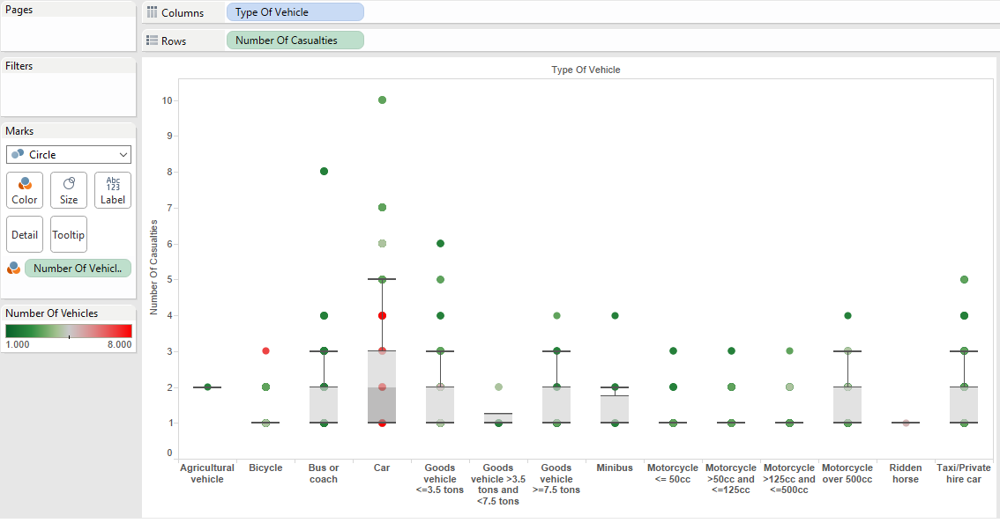
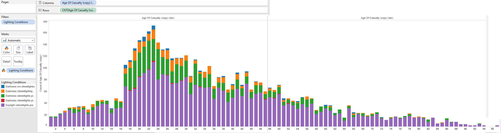
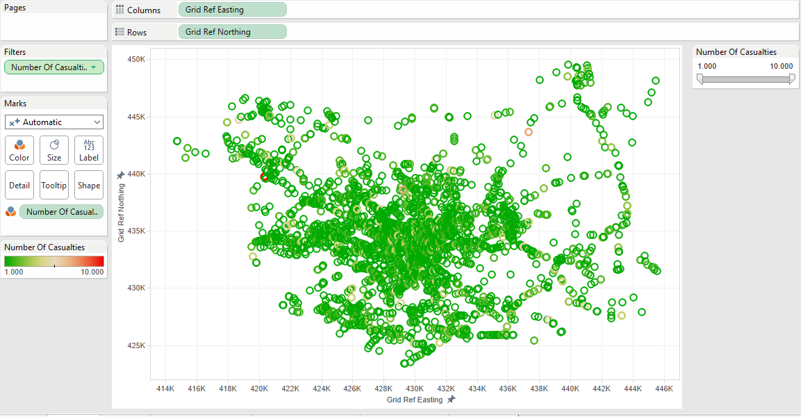
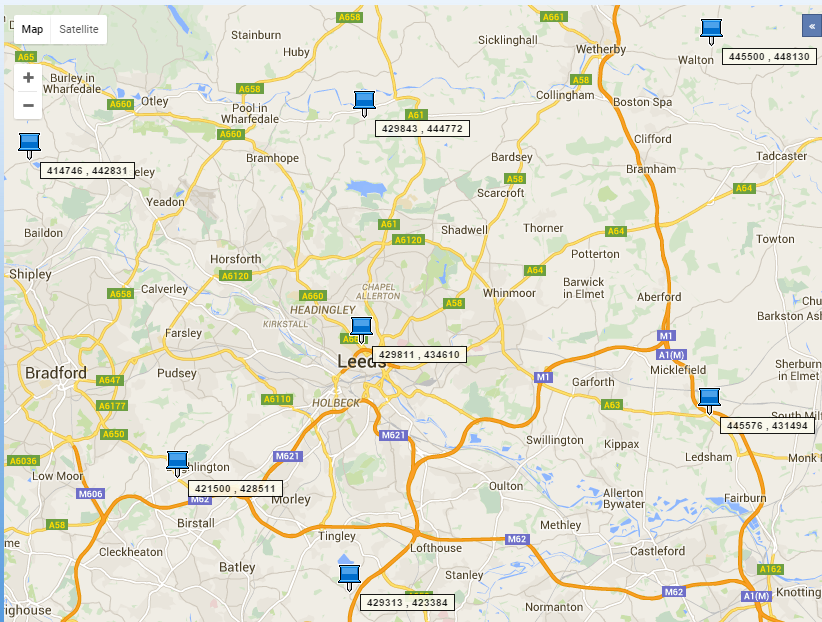
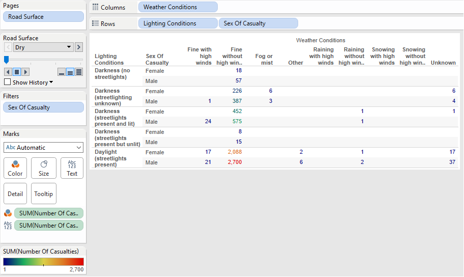
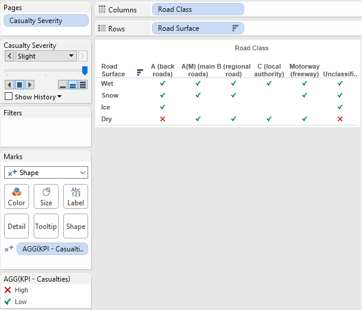
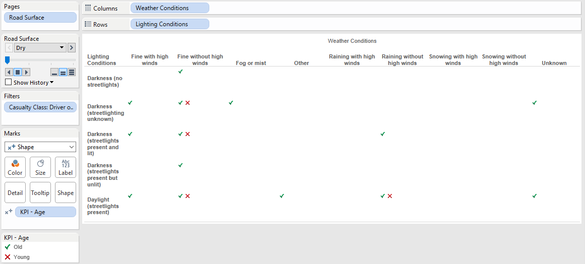

##Road Accidents in Leeds, England  

<h3>Tableau Plots:</h3>  
<h4>Boxplot:</h4>  

<br>
To create this boxplot, start by clicking on Number of Casualties under measures, and then click on the Boxplot icon under the Show Me tab.Drag Type of Vehicle onto columns, and Number of Vehicles onto color.

<br>  
<h4>Histogram:</h4>  
 
To create this histogram, start by clicking Age of Casualty under measures, and then click on the Histogram icon under the Show Me tab. Change the bin size to 1 to show every age. Drag Lighting Conditions onto color and filters.
<br>  
<h4>Scatterplot and its corresponding map:</h4>  
 
<br>
  
To create this scatterplot, start by dragging Grid Ref Easting onto columns and Grid Ref Northing onto rows. Drag Number of Casualties onto color and filters, and then showed quick fliter.
<br>
<h4>Crosstabs:</h4>  
  
To create this first crosstab, start by dragging Lighting Conditions onto rows and Weather Conditions onto columns. Then drag Number of Casualties onto color and text. Drag Sex of Casualty onto filters, and then onto rows. Then drag Road Surface onto pages.
<br>  
   
To create this second crosstab, start by dragging Road Class onto columns and Road Surface onto rows. Make a calculated field called KPI - Casualties that looked like this:
```
IF (ATTR([Casualty Severity]) == 'Fatal' AND (SUM([Number Of Casualties])) <= 11)
THEN "Low"
ELSEIF (ATTR([Casualty Severity]) == 'Serious' AND SUM([Number Of Casualties]) <= 156)
THEN "Low"
ELSEIF (ATTR([Casualty Severity]) == 'Slight' AND SUM([Number Of Casualties]) <= 1431)
THEN "Low"
ELSE "High"
END
```
Drag this new calculated field onto shapes. Then drag Causalty Severity onto pages. To change the shape of the data points, click on Edit Shapes under the card that displays "High" and "Low".  
<br>
  
To create this third crosstab, start by dragging Weather Conditions onto columns, and Lighting Conditions onto rows. Then create a new calculated field called KPI - Age that looks like this:
```
if [Age Of Casualty] < 18 then "Young"
else "Old"
end
```
Drag the new calculated field shape. To change the shape, click Edit Shapes under the card that displays "Old" and "Young". Then, drag Casualty Class onto filter and choose 'Driver or rider'. Drag Road Surface onto pages.
<br>
<h4>Barcharts:</h4>

